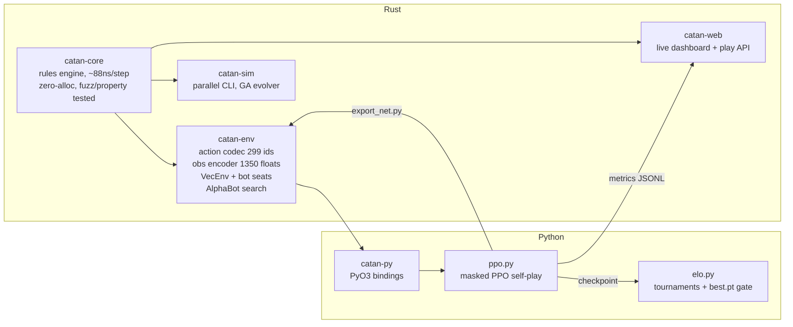

# Catan RL — a Settlers of Catan engine and self-learning agent

A complete reinforcement-learning stack for 4-player Settlers of Catan,
built from scratch: a zero-allocation Rust rules engine (~88 ns/step), a
batched RL environment with PyO3 bindings (~3.4M policy-steps/s), PPO
self-play training, a live training dashboard, an Elo tournament harness —
and an AlphaZero-style search agent that beats a competent scripted player
**82%** of the time in 4-player games (fair share: 25%).

Everything below was trained and measured on a laptop CPU.

## Headline results

Win rate vs three frozen heuristic opponents, 4-player first-to-7:

| Agent | Win rate | What it is |
|---|---|---|
| Random | ~0% | uniform legal moves |
| Heuristic-v1 | 26% | hand-written priority rules (= fair share) |
| Heuristic-v2 | 40% | v1's weights tuned by a genetic algorithm |
| RolloutBot | 43–72.5% | flat Monte Carlo search (scales with rollouts) |
| PPO policy | 65% | 2-layer MLP, self-play + mixed-opponent training |
| **AlphaBot** | **82%** | **policy-prior-guided search (AlphaZero-lite)** |

The interesting part is the journey: the PPO policy hit a hard wall at 65%
that survived 8× more training, doubled exploration, diverse opponents,
and a 4× larger network — a controlled-experiment elimination recorded in
[training/results/EXPERIMENTS.md](training/results/EXPERIMENTS.md). The
wall broke only when the policy was given *planning*: its own policy head
pruning a Monte Carlo search. Reactive policies plateau; search breaks
through — the TD-Gammon → AlphaGo arc, reproduced on a laptop in a day.

## Architecture



## Quickstart

Rust toolchain required (`rustup`); Python 3.10+ with `torch numpy maturin`
for the training side.

```bash
# 1. Verify the engine (rulebook scenarios, property tests, fuzzing,
#    longest-road oracle, zero-allocation proofs, replay goldens)
cd rust && cargo test --release

# 2. Watch agents fight (R random, H heuristic, V evolved, O rollout)
cargo run -p catan-sim --release -- --games 1000 --players H,R,H,R

# 3. The headline agent: AlphaZero-lite with the shipped trained network
cargo run -p catan-sim --release -- --games 100 --players A,H,H,H \
    --net ../models/catan-512.ctnn --alpha-config 8,96,300

# 4. Play against the engine in your browser
cargo run -p catan-web --release   # then open http://127.0.0.1:5050
cd ../visualizer && npm install && npm run dev   # "Play vs Engine" mode

# 5. Train your own agent and watch it live
cd ../rust/catan-py && maturin develop --release && cd ../..
python training/ppo.py --name myrun --minutes 10 --victory-target 7 \
    --vp-delta 0.05 --train-seats policy,heuristic,policy,heuristic \
    --metrics /tmp/metrics.jsonl
# dashboard: cargo run -p catan-web --release -- --metrics-file /tmp/metrics.jsonl

# 6. Rate agents on the Elo ladder
PYTHONPATH=training python training/elo.py tournament <checkpoint.pt>
```

`models/` ships the trained 512-hidden network (PyTorch checkpoint +
`catan-512.ctnn`, a self-verifying binary the Rust search loads directly)
and sample compact replays (`.ctrp`, ~4.5 bytes/action).

## Repo map

- `rust/` — the engine workspace; see [rust/README.md](rust/README.md) for
  the testing fortress, rules coverage, and performance methodology.
- `training/` — PPO trainer, Elo harness, net export; see
  [training/README.md](training/README.md) for the checkpoint contract and
  metrics schema.
- `training/results/` — the full experiment ledger and raw run logs.
- `docs/PRESENTATION.md` — the story of the build, end to end.
- `engine/`, `catan_service/`, `visualizer/` — the original Python engine
  (kept for the 3D visualizer) and the browser frontend.

## License

MIT — see [LICENSE](LICENSE).
