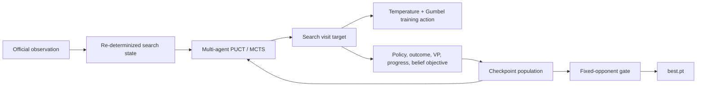

# Training: PPO and search self-play

## CatanZero

`catanzero.py` is the laptop-scale hidden-information search trainer. It
warm-starts from the shipped PPO policy, uses official-information
observations, re-determinizes unknown cards for information-set MCTS, and
distills root visit counts into a policy with four relative-seat value
heads and a hidden-card belief head.



The shaped reward is potential-based:

```text
r' = r + beta * (Phi(next) - Phi(current))
```

Terminal potential is zero, so shaping changes intermediate credit without
changing the full-game optimum.

The potential itself is intentionally small and legible:

```text
Phi = 0.90 * VP progress
    + 0.06 * total expected resource income
    + 0.04 * best strategy income
```

Strategy income is the best expected purchase rate among expansion
(road plus settlement), cities (wheat plus stone), and development cards
(wheat, sheep, and stone). One VP is always worth more than the complete
resource portion of the potential.

The optimization objective is:

```text
CE(search visits, policy)
+ stage_weight * CE(legacy policy, policy)
+ MSE(outcome)
+ 0.25 * MSE(final VP)
+ 0.25 * MSE(progress potential)
+ 0.10 * MSE(hidden-card belief)
```

Training uses MCTS, temperature, and Gumbel exploration. An online EM step
tunes the mixture of learned policy prior and uniform legal exploration,
with at least 10% exploration retained. Greedy inference is a single
forward pass.

Warm-start continuation can choose a curriculum profile and start offset.
The overnight harness currently tests baseline, league-heavy opponent
sampling, stronger PPO anchoring, lower auxiliary weight, larger search,
and a hard 20% uniform-exploration reserve.

Before self-play, parallel AlphaBot teachers generate a reusable
`bootstrap_v2_dataset.pt`. Each label aggregates AlphaBot actions across
multiple hidden-state re-determinizations. Trajectories come from the
teacher, prior champion, heuristics, and legacy policy. Bootstrap fitting
is policy-only with a trajectory-disjoint validation split and early
stopping, followed by a DAgger pass over student-visited states.

Auxiliary losses are introduced gradually during self-play. Checkpoints
are evaluated with greedy and eight-simulation inference and cannot be
promoted unless they achieve at least fair-share performance against the
prior CatanZero champion.

The wall-clock curriculum progresses through:

1. `bootstrap`: 4 simulations, shaped rewards, heuristic v1 and self-play.
2. `transition`: 8 simulations, reduced shaping, heuristic v2, self-play,
   and frozen historical policies.
3. `league`: 16 simulations, no shaping, mostly self-play and historical
   policies.

```bash
python training/catanzero.py train \
    --minutes 10 --checkpoint-minutes 3 --eval-games 12 \
    --hidden 512 --bootstrap-workers 8 --selfplay-workers 4
python training/catanzero.py evaluate training/runs/<run>/best.pt --games 24
```

Each checkpoint is evaluated against heuristic v1, heuristic v2, the
legacy PPO policy, AlphaBot, the previous checkpoint, and the prior
CatanZero champion. The fixed-opponent score and champion gate preserve
the highest eligible checkpoint as `best.pt`.

Evaluation reuses each board seed with the candidate in all four seats.
Champion promotion additionally runs every two-seat candidate lineup on
the same board seeds, so an identical-policy 2-vs-2 control is exactly
50%. This avoids coupling candidate seat to board seed and avoids relying
only on a potentially misleading one-policy-vs-three-clones matchup.

```bash
python training/overnight.py \
    --minutes 8 --eval-games 16 --validation-games 48
python training/reselect_checkpoints.py \
    training/runs/<run> training/runs/<champion>/best.pt
python training/evaluate_checkpoint_matrix.py \
    training/runs/<run>/paired_best.pt training/runs/<champion>/best.pt \
    --output training/runs/<run>/final_evaluation.json
```
See [results/CATANZERO_20260611.md](results/CATANZERO_20260611.md) for the
first bounded run and
[results/CATANZERO_20260611_PR1.md](results/CATANZERO_20260611_PR1.md)
for the compact parallel rerun using the PR #1 inference optimization.
The controlled 1024-wide follow-up is in
[results/CATANZERO_20260611_1024.md](results/CATANZERO_20260611_1024.md).
The redesigned 512-wide bootstrap and its successful holdout are in
[results/CATANZERO_20260611_BOOTSTRAP_V2.md](results/CATANZERO_20260611_BOOTSTRAP_V2.md).
The multi-profile campaign and corrected paired evaluation are in
[results/CATANZERO_20260612_OVERNIGHT.md](results/CATANZERO_20260612_OVERNIGHT.md).

`ppo.py` is the trainer: masked PPO over `catan_py.VecEnv`, one policy
playing all seats, per-(env, seat) trajectory chains for the AEC reward
semantics, GAE with gamma=1.0 (episodic — don't discount 600-step credit),
lambda=0.95. It emits `train`/`eval`/`game` events to the metrics stream
(watch on the catan-web dashboard) and saves checkpoints per the contract
below. Stage-1 smoke run:

```bash
python training/ppo.py --name stage1 --minutes 10 \
    --victory-target 7 --vp-delta 0.05 --metrics /tmp/catan-metrics.jsonl
rust/target/release/catan-web --metrics-file /tmp/catan-metrics.jsonl
```

`smoke_env.py` is the bindings contract test — run it after rebuilding
catan-py.

## Artifact storage and checkpoint gating

## Directory layout

```
training/
├── configs/                  # versioned run configs (IN git)
├── ppo.py, eval.py, ...      # training code (IN git)
└── runs/                     # all run artifacts (NOT in git)
    └── <date>-<name>/        # e.g. 2026-06-20-first-to-7-baseline
        ├── config.yaml       # frozen copy of the exact config used
        ├── meta.json         # git commit, codec/obs versions, seeds, host
        ├── tensorboard/      # curves (entropy, EV, clip frac, win rates)
        ├── eval/             # eval results per checkpoint (CSV)
        ├── replays/          # .ctrp game records from eval (video source)
        └── checkpoints/
            ├── step_00010000.pt
            ├── latest.pt -> ...      # symlink, updated every save
            ├── best.pt -> ...        # symlink, updated ONLY via the gate
            └── pool/                 # frozen self-play opponents
```

## Checkpoint contract

Every checkpoint `.pt` bundles (single torch.save dict):

- `model_state`, `optimizer_state`, `global_step`, `rng_states`
- `config`: the full run config (not a path — the actual values)
- `codec_version`: must equal `catan_env::CODEC_VERSION` (currently 1)
- `num_actions`: must equal `catan_env::NUM_ACTIONS` (currently 299)
- `obs_version` / `obs_dim`: must match the observation encoder
- `engine_commit`: `git rev-parse HEAD` at save time

**Loading MUST hard-fail on any version mismatch.** A checkpoint trained
against action layout v1 run against layout v2 doesn't crash — it plays
confidently wrong moves. The version check turns a silent corruption into
a loud error.

Saves are atomic: write to `step_X.pt.tmp`, fsync, rename. A crash mid-save
must never corrupt the latest checkpoint.

## Promotion gates

- `latest.pt`: every save. No gate.
- `pool/`: every Nth checkpoint (default: 1 per 30 min of training),
  kept forever — self-play opponents and the Elo ladder.
- `best.pt`: promoted ONLY when a fixed evaluation passes:
  400 games vs Heuristic-v1 on fixed seeds, low temperature, mixed
  seating; promote if win rate beats the current best.pt's recorded
  score by more than 2 points (outside seed noise). The eval result is
  stored next to the checkpoint in `eval/`.

Anything that ships (the video, a demo, the visualizer bot) loads
`best.pt`, never `latest.pt`.

## Game replays (video pipeline)

Eval games are recorded as `.ctrp` binary records (~2-6 KB/game; format in
`rust/catan-core/src/replay.rs`, written via `GameRecord`). Inspect any
replay with:

```
rust/target/release/catan-sim --dump-replay runs/<run>/replays/<file>.ctrp
```

Recording per checkpoint eval (a few hundred games) costs ~1-2 MB — record
every eval, forever. The video shows the same fixed seeds played by
checkpoints across training time.

## Live metrics stream (dashboard contract)

All producers append JSON lines to one metrics file; `catan-web` tails it
and serves the live dashboard at `http://127.0.0.1:5050/dashboard`:

```
rust/target/release/catan-web --metrics-file <run>/metrics.jsonl
```

Event types (one JSON object per line, `unix_ms` on everything):

- `{"t":"run", "source":, "games":, "players":[...], "seed":}` — once, at start.
- `{"t":"game", "i":, "winner":, "turns":, "steps":, "vp":[...], "cap":bool}`
  — per finished game (`catan-sim --metrics` emits these today; the env's
  rollout loop will too).
- `{"t":"train", "step":, "entropy":, "explained_variance":, "clip_frac":,
  "policy_loss":, "value_loss":, "lr":, "sps":}` — per PPO update.
- `{"t":"eval", "step":, "vs":"heuristic-v1", "win_rate":, "games":,
  "avg_vp":, "cap_rate":}` — per checkpoint evaluation, one line per opponent.

The dashboard's health panel turns these into OK/WATCH/BAD verdicts with
explanations (turn-cap rate, throughput collapse, entropy cliff, explained
variance bands, clip-fraction bands, eval-regression detection) — the curve
reading rules, automated.

## Promoted AlphaBot best response

The promoted 512-wide policy uses the existing CatanZero champion with an
opinionated greedy inference policy:

```bash
.venv/bin/python training/evaluate_planner_vs_alpha.py \
  training/runs/20260611-catanzero-v2/best.ctnn \
  --planner hybrid-v2 \
  --strategy-settlement-weight 5 \
  --heuristic-refinement \
  --games 96 \
  --seed 23900000
```

This policy scored `70/96` (72.9%) against three fair AlphaBots at
`8x96d300`, paired across all four candidate seats. The same network with the
previous settlement-only inference scored `56/96` on the same boards. See
`training/results/ALPHA_BEST_RESPONSE_20260612.md` and
`training/runs/20260612-alpha-best-response-promoted.json`.
